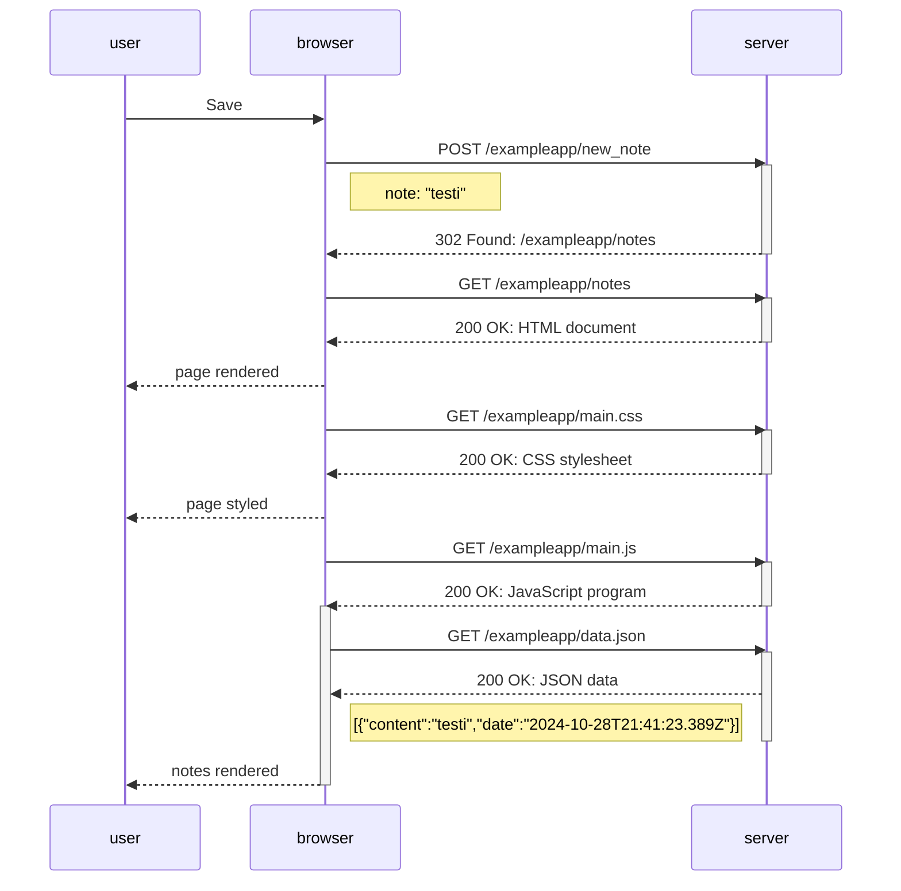

```mermaid
sequenceDiagram
    participant user
    participant browser
    participant server

    user->>browser: Save
    browser->>server: POST /exampleapp/new_note
    activate server
    note right of browser: note: "testi"
    server-->>browser: 302 Found: /exampleapp/notes
    deactivate server
    browser->>server: GET /exampleapp/notes
    activate server
    server-->>browser: 200 OK: HTML document
    deactivate server
    browser-->>user: page rendered
    browser->>server: GET /exampleapp/main.css
    activate server
    server-->>browser: 200 OK: CSS stylesheet
    deactivate server
    browser-->>user: page styled
    browser->>server: GET /exampleapp/main.js
    activate server
    server-->>browser: 200 OK: JavaScript program
    deactivate server
    activate browser
    browser->>server: GET /exampleapp/data.json
    activate server
    server-->>browser: 200 OK: JSON data
    note right of browser: [{"content":"testi","date":"2024-10-28T21:41:23.389Z"}]
    deactivate server
    browser-->>user: notes rendered
    deactivate browser
```