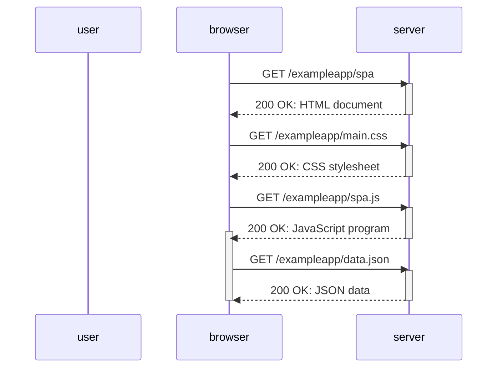

```mermaid
sequenceDiagram
    participant user
    participant browser
    participant server
    browser->>server: GET /exampleapp/spa
    activate server
    server-->>browser: 200 OK: HTML document
    deactivate server
    browser->>server: GET /exampleapp/main.css
    activate server
    server-->>browser: 200 OK: CSS stylesheet
    deactivate server
    browser->>server: GET /exampleapp/spa.js
    activate server
    server-->>browser: 200 OK: JavaScript program
    activate browser
    deactivate server
    browser->>server: GET /exampleapp/data.json
    activate server
    server-->>browser: 200 OK: JSON data
    deactivate server
    deactivate browser
```